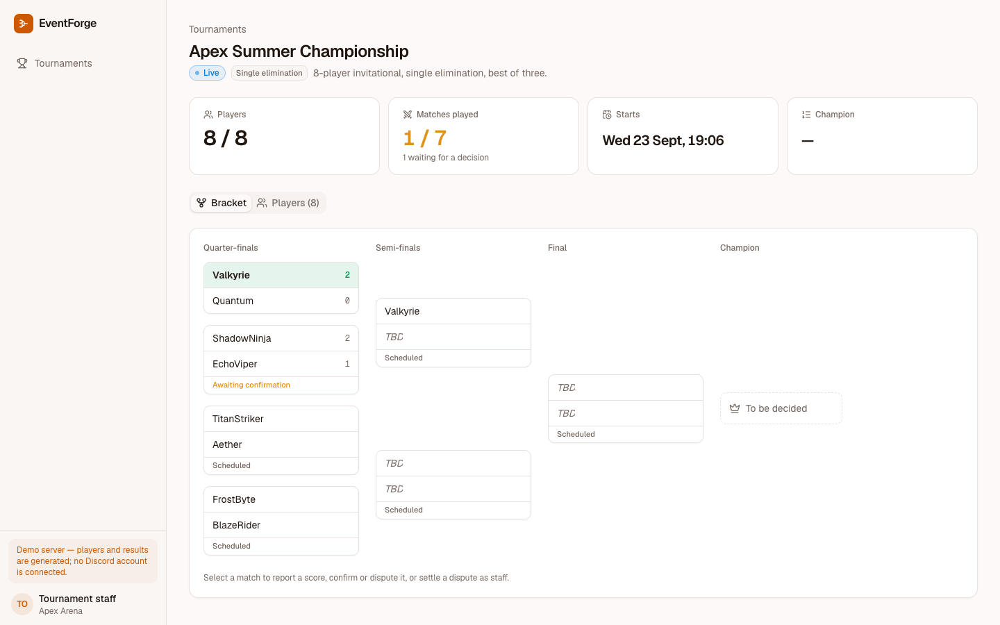
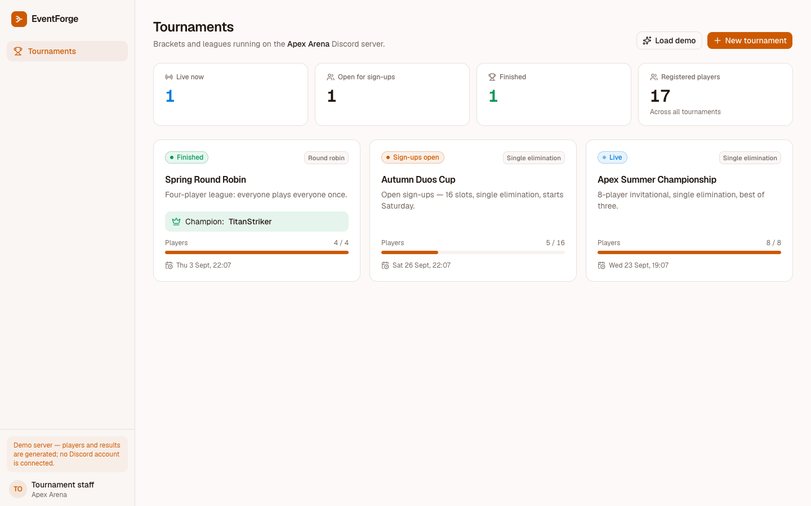
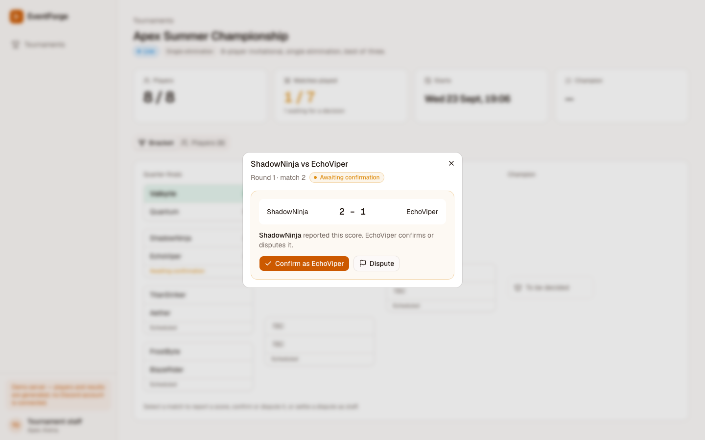
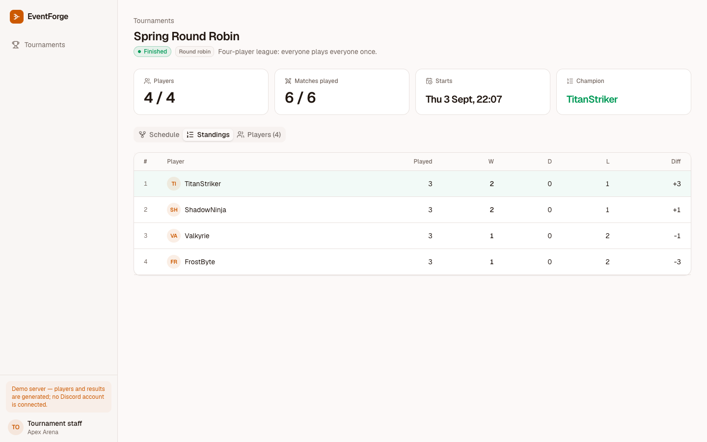
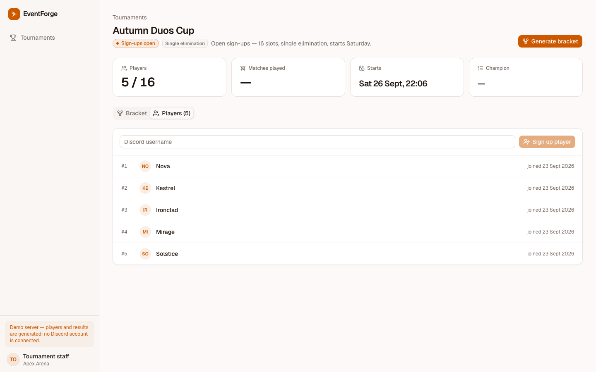
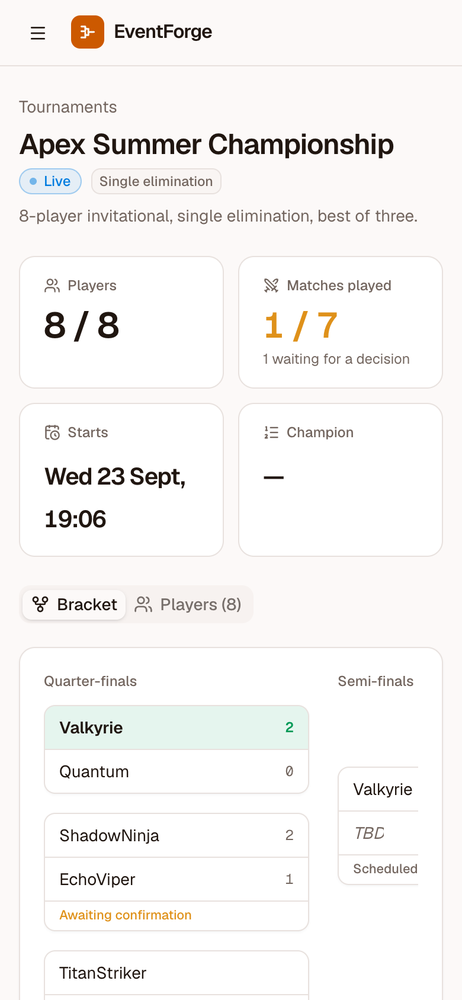
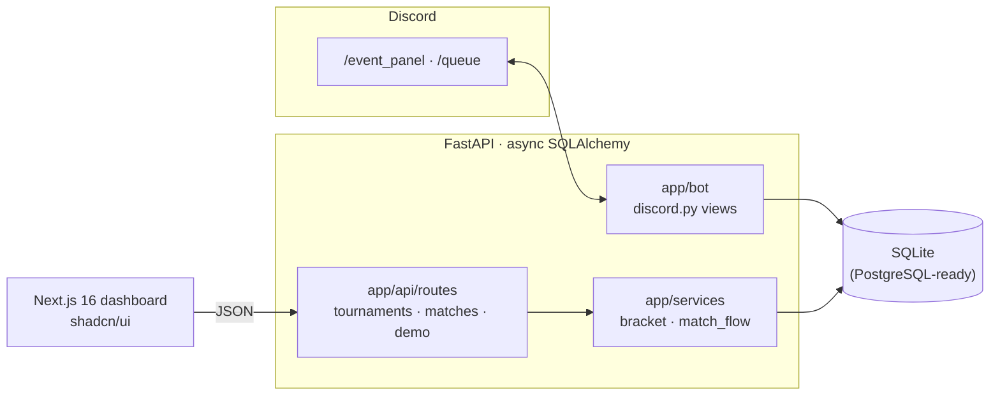
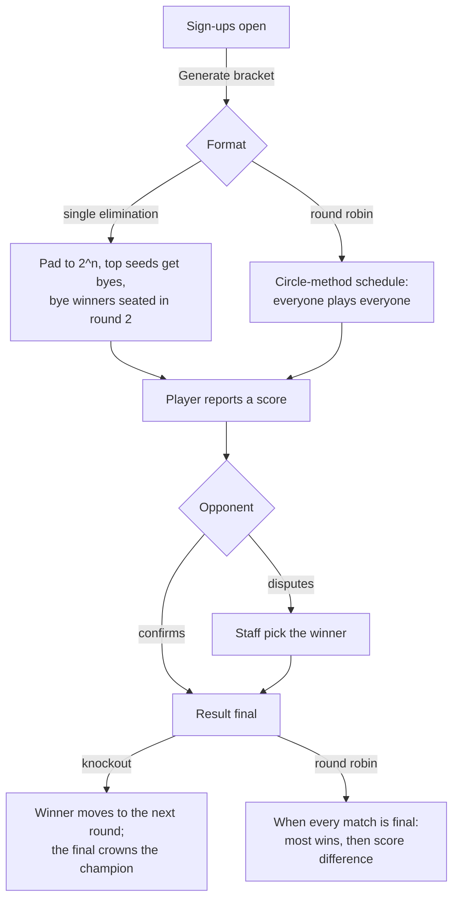

# EventForge

**Run the tournament where your players already are.** EventForge takes sign-ups in
Discord, then seeds a single-elimination bracket with fair byes or a round-robin league.
Players report their own scores: the opponent confirms, and disputes go to staff. The
dashboard shows the live bracket, standings and every match that needs a decision.

It runs brackets and leagues for one community. It is not a matchmaking service or a
ladder with ratings.

> Portfolio project. The "Apex Arena" server and its players are fictional. The
> tournaments and results are generated by the seed script.



| Tournaments | Reporting and confirming a result |
| --- | --- |
|  |  |
| **Round-robin standings** | **Sign-ups** |
|  |  |

<p align="center"></p>

## Contents

- [Features](#features)
- [Architecture](#architecture)
- [Brackets and match flow](#brackets-and-match-flow)
- [Security](#security)
- [API overview](#api-overview)
- [Getting started](#getting-started)
- [Demo walkthrough](#demo-walkthrough)
- [Testing](#testing)
- [Environment variables](#environment-variables)
- [Known limitations](#known-limitations)

## Features

**In Discord (`python -m app.bot`)**

- `/event_panel` posts a tournament panel with **Register / Join**, **View
  Participants**, and a link to the bracket on the web.
- `/queue` posts a 1v1 queue. The first two players to join are paired and pinged in
  the channel.

**In the dashboard**

- **Tournaments:** cards with status, format, a sign-up progress bar, start time and
  champion. Create a knockout or a league from a dialog.
- **Bracket:**
  - Rounds in columns (Quarter-finals, Semi-finals, Final) plus a champion slot.
  - Bye matches marked.
  - Scores and each match's state shown on the card.
- **Match dialog:**
  - One player reports the score; the other confirms or disputes it.
  - Staff settle a dispute by picking the winner.
  - The dialog knows who reported, so it offers confirmation to the right player.
- **Round robins:** the schedule by round, and a standings table (W/D/L, score
  difference).
- **Players:** seeds and sign-up times. Players can be signed up while registration is
  open.

**Rules the API enforces**

- Brackets are padded to the next power of two. Top seeds get the byes, and **bye
  winners are placed in round two** straight away.
- Sign-ups close once the bracket exists, and a second bracket can't be generated.
- A score can only be reported while a match is open, and confirmed once. The reporter
  can't confirm their own score.
- Knockout ties are rejected when they're reported.
- Disputes come from one of the two players. Staff overrides must name one of the two
  players.
- Round robins finish only when every match is confirmed. The champion has the most
  wins, then the best score difference, the same order the standings show.

## Architecture



```
backend/app
├── api/routes/     tournaments, matches, demo
├── bot/            discord.py client and panels, python -m app.bot
├── models/         tournament (Tournament, Participant, audit log), match
├── schemas/        request/response models
├── services/       bracket (seeding, byes, round robin), match_flow (report → confirm → advance)
├── db/             base, async session
└── seed.py         demo data: python -m app.seed [--reset]
frontend/src
├── app/            landing, (app)/dashboard, (app)/tournaments/[id]
└── components/     kit/ (shared house style), bracket, match dialog, new-tournament dialog
```

## Brackets and match flow



A bracket for *n* players has 2^⌈log₂ n⌉ slots. With 5 players that's 8 slots, so seeds
1–3 get byes and start in the semi-final slots.

## Security

| Concern | What EventForge does |
| --- | --- |
| Result tampering | Only the two players can report, confirm or dispute. Reporters can't confirm themselves, and finished matches are immutable. |
| Double processing | Confirmations and overrides are state-checked, so a winner can't advance twice. |
| Invalid data | Formats are validated enums, scores are non-negative, and usernames are length-limited. |
| Match lists | Scoped to the server that owns the tournament. |
| Dashboard access | **Not authenticated.** See [Known limitations](#known-limitations). |

## API overview

Interactive docs are at `http://localhost:8000/docs`. All paths start with `/api/v1`.

| Method | Path | |
| --- | --- | --- |
| GET / POST | `/tournaments/{guild}` | List or create tournaments |
| GET | `/tournaments/{guild}/{id}` | Tournament and players |
| POST | `/tournaments/{guild}/{id}/join` | Sign up a player (while registration is open) |
| POST | `/tournaments/{guild}/{id}/generate-bracket` | Seed the bracket or schedule (once) |
| GET | `/tournaments/{guild}/{id}/matches` | Every match, by round |
| POST | `/matches/{id}/submit` | A player reports a score |
| POST | `/matches/{id}/confirm` | The opponent confirms |
| POST | `/matches/{id}/dispute` | The opponent disputes |
| POST | `/matches/{id}/override` | Staff pick the winner |
| POST | `/demo/seed` | Load the demo tournaments (idempotent) |

## Getting started

Requirements: Python 3.12+ and Node 20+.

```bash
make install        # backend venv + frontend deps
make seed           # demo tournaments (resets the local database)
make api            # http://localhost:8000
make web            # http://localhost:3000
```

Without make:

```bash
cd backend && python3 -m venv .venv && .venv/bin/pip install -r requirements-dev.txt
cp ../.env.example ../.env
.venv/bin/python -m app.seed --reset
.venv/bin/uvicorn app.main:app --port 8000
cd ../frontend && npm install && npm run dev
```

### Running the Discord bot

1. Create a bot in the Discord developer portal and put its token in
   `DISCORD_BOT_TOKEN`. Set `APP_URL` to where the dashboard is hosted; the panel links
   there.
2. Invite it with the `applications.commands` and `bot` scopes.
3. Run it with `cd backend && .venv/bin/python -m app.bot`, then use `/event_panel` in a
   channel.

## Demo walkthrough

1. **Apex Summer Championship** is live. Open the quarter-final marked *Awaiting
   confirmation* and press **Confirm as EchoViper**. ShadowNinja moves into the
   semi-final.
2. Open *TitanStriker vs Aether*, report a score, open it again and **Dispute** it, then
   settle it as staff.
3. **Autumn Duos Cup** is taking sign-ups. Add a player, then **Generate bracket**. Late
   sign-ups and a second bracket are refused.
4. **Spring Round Robin** shows the finished standings and its champion.

## Testing

```bash
make test           # 14 tests
```

The tests cover:
- powers of two and bracket sizes, including bye winners seated in round 2
- round-robin pairings and the leader tie-break
- the report → confirm → advance flow
- refusing to confirm or report twice
- knockout ties
- a round robin finishing only when every match is played
- bracket generation happening once and closing sign-ups
- idempotent seeding

CI runs the backend tests, then lints and builds the frontend
([.github/workflows/ci.yml](.github/workflows/ci.yml)).

## Environment variables

See [.env.example](.env.example).

| Variable | Default | |
| --- | --- | --- |
| `DATABASE_URL` | `sqlite+aiosqlite:///./eventforge.db` | Any async SQLAlchemy URL |
| `CORS_ORIGINS` | `http://localhost:3000,…` | Browser origins allowed to call the API |
| `DISCORD_BOT_TOKEN` | — | Only needed for `python -m app.bot` |
| `APP_URL` | `http://localhost:3000` | Where the bot's bracket link points |

## Known limitations

- **No sign-in on the dashboard or API.** Staff actions (overrides, bracket generation)
  are open to anyone who can reach it. Put it behind your own auth before exposing it.
- The 1v1 queue lives in the bot's memory. Pairings aren't recorded as matches, and the
  queue empties when the bot restarts.
- There are no double-elimination or Swiss formats.
- The Discord panels' persistent buttons aren't re-registered after a bot restart.

## License

MIT © Moeijiro
